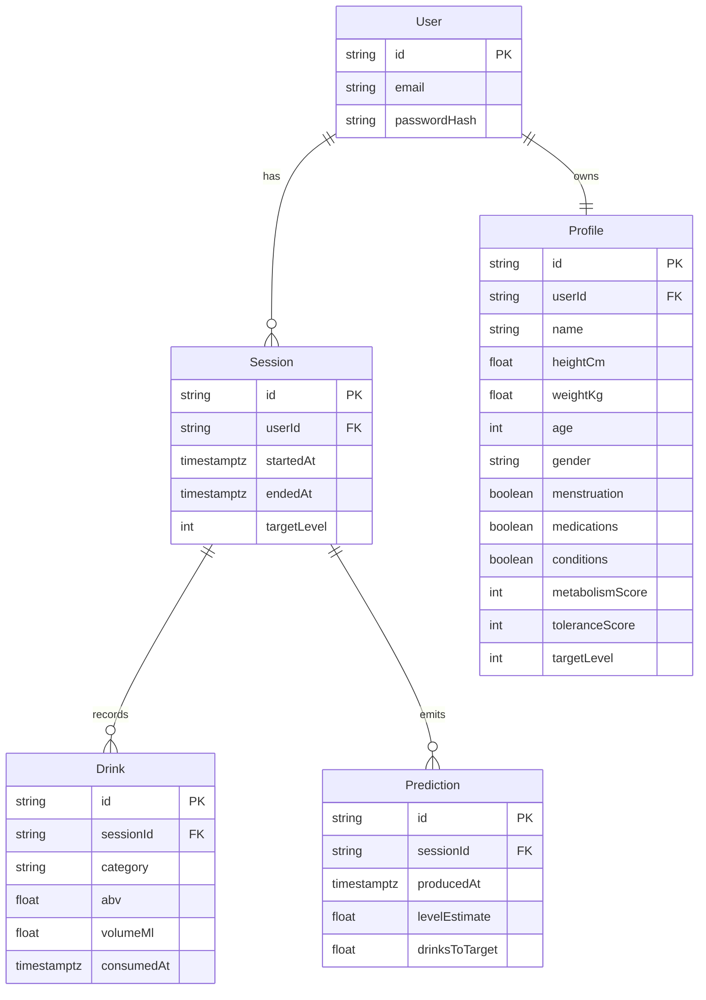

# Next.js Vertical Slice Plan

## Scope
Deliver a production-level prototype of the PinkDrunk core loop in Next.js, covering onboarding, session start, drink logging, and Widmark-based predictions with user-defined targets.

## Architecture Overview
- **Framework:** Next.js 15 (App Router) with TypeScript, React Server Components, and Server Actions.
- **Runtime:** Vercel Edge for statics, Node runtime for API routes requiring computation (Widmark, persistence).
- **State Management:** Server components for initial data, React context + Zustand for client session state (onboarding wizard, live session); use React Query for data fetching/mutation.
- **Styling:** Tailwind CSS with custom tokens reflecting PinkDrunk palette, Radix UI primitives for accessibility, Framer Motion for subtle animations.
- **Forms:** React Hook Form + Zod for schema validation, shared types between client and server.
- **Persistence:** Prisma ORM connected to PostgreSQL (Neon for cloud dev) with schema mirroring `data-model.md`; for local dev use SQLite shadow DB via Prisma.
- **Auth:** NextAuth.js with email/password credentials provider stored in Prisma `users` table; session stored via JWT.
- **Telemetry:** Vercel Analytics + PostHog stub for event capture (optional environment-driven).

## Data Model (Prototype Slice)

## Feature Breakdown
1. **Project Scaffolding**
   - Initialize Next.js with TypeScript, Tailwind, ESLint, Prettier.
   - Configure absolute imports, environment handling, lint/test scripts.
   - Install dependencies: `@prisma/client`, `prisma`, `next-auth`, `zustand`, `@tanstack/react-query`, `zod`, `react-hook-form`, `tailwindcss`, `radix-ui`, `framer-motion`.
   - Set up Prisma schema aligned with prototype entities; run migrations.

2. **Auth & Layout Shell**
   - Implement NextAuth credentials provider with custom login/signup pages.
   - Create protected layout segment requiring session; fallback to sign-in.
   - Build nav shell matching IA (Today, History, Profile, Settings) with placeholders.

3. **Onboarding Wizard**
   - Client-side multi-step form using Zustand store and React Hook Form.
   - Steps exactly as defined in onboarding flow (email/password handled prior).
   - Persist profile to backend via Server Action on completion.
   - Store `pinkdrunk_target_user` in profile; redirect to session start.

4. **Session Start & Logging**
   - Sessions page loads current session or offers “Start Session” button (Server Action creates row).
   - Live dashboard with components: current level card, recommended action, quick-add drink buttons.
   - Drink logging modal (preset categories, manual ABV/volume) posts to `/api/sessions/[id]/drinks` route.

5. **Widmark Prediction Service**
   - Implement utility module `lib/widmark.ts` computing BAC → PinkDrunk score using target and tolerance modifiers.
   - Server Action `computePrediction` triggered on drink log and at interval; stores prediction in DB.
   - Display `levelEstimate`, `drinksToTarget`, highlight when at/near target, risk warnings when crossing thresholds.

6. **Session End & Recap**
   - “End Session” action finalizes session, captures final subjective rating, displays recap screen.
   - History page lists prior sessions with summary stats.

7. **Quality & Tooling**
   - Unit tests for Widmark calculator (Vitest) and form schema validations.
   - Integration test for onboarding flow using Playwright.
   - GitHub Actions pipeline: install, lint (`next lint`), test (`vitest`), type-check (`tsc --noEmit`), build (`next build`).

## Timeline / Tasking
- Day 1: Scaffolding, Prisma schema, auth shell.
- Day 2: Onboarding wizard + profile persistence.
- Day 3: Session dashboard, drink logging, prediction engine.
- Day 4: Recap flow, history, refinements, QA automation.

## Risks & Mitigations
- **BAC formula accuracy:** Start with deterministic Widmark + tolerance adjustments; log deviations for future ML.
- **State sync between client/server:** Use React Query for drink submissions to avoid stale dashboards.
- **Performance on Vercel Edge:** Keep heavy prediction logic in Node runtime functions.
- **Compliance:** Only store necessary PII; ensure `.env` encrypts secrets, note for future DPA tasks.

## Deliverables
- Next.js repo with full vertical slice and production-ready tooling.
- Documentation in `/docs/vertical-slice.md` covering setup, env vars, testing commands.
- Demo instructions for stakeholders (seed script + walkthrough).
